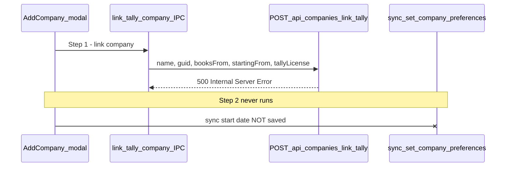

# Fix Desktop Agent "link-tally-company" 500 Error

## What is actually failing

When you click **Link company** in the sync date modal, the app runs **two steps in order**:



**Your sync start date (Apr 2025, Asia/Kolkata) is saved in Step 2 only.** Because Step 1 fails with HTTP 500, the sync date is never the cause — it is never sent to the server at this stage.

Relevant code:

- UI trigger: [`desktop-agent/renderer/src/pages/AddCompany.jsx`](desktop-agent/renderer/src/pages/AddCompany.jsx) — `handlePrefsSave()` calls `linkTallyCompany()` **before** `setCompanySyncPreferences()`
- IPC handler: [`desktop-agent/main.js`](desktop-agent/main.js) (~line 1116) — `axios.post(.../companies/link-tally, ...)`
- Backend route: [`backend/src/routes/companies.js`](backend/src/routes/companies.js) (~line 90)

---

## Why you only see a generic error

The IPC handler in [`desktop-agent/main.js`](desktop-agent/main.js) has **no try/catch** around the axios call. When the backend returns 500, Electron surfaces:

`AxiosError: Request failed with status code 500`

The backend **does** return a useful message in the JSON body:

```json
{ "success": false, "message": "<actual reason>" }
```

…but the desktop app never reads `error.response.data.message`, so you cannot see the real cause in the UI.

---

## Step 1: Read the backend log (you confirmed you can)

Reproduce the error once, then search backend logs for:

```text
Link Tally company error:
```

That log line is written in [`backend/src/routes/companies.js`](backend/src/routes/companies.js) catch block. The message after it is the **exact root cause**.

### Expected messages and meaning

| Log / error.message | Meaning | Likely fix |
|---|---|---|
| `This Tally serial number is already registered with ...` | Tally license serial is bound to another FinSync account. Desktop agent auto-sends `tallyLicense` on every link attempt. | Use the account that owns the serial, or admin-unbind the serial in DB; code fix: return **409** not 500, and allow company link to succeed even if serial registration fails |
| `Company name cannot be more than 100 characters` | Route allows name up to 200 chars, but [`Company` schema](backend/src/models/Company.js) max is **100** | Truncate/sanitize name in `upsertCompany`, or align validation limits |
| `Please add a valid email` / `Please add a valid pincode` | Mongoose validation on placeholder contact fields when updating an existing bad company record | Fix defaults or skip invalid contact on link |
| `Financial year end date must be after start date` | Pre-save hook in Company model | Fix FY date math in `upsertCompany` |
| `Cannot read properties of undefined (reading 'toString')` inside serial registration | Legacy `TallySerialRegistration` row missing `organization` field | Add null-safe check in [`tallySerialService.js`](backend/src/services/tallySerialService.js) |
| `Server error checking subscription` | Middleware failure before handler runs | Fix org/subscription provisioning in [`licenseService.js`](backend/src/services/licenseService.js) |

**Most common in production:** Tally serial conflict — because [`main.js`](desktop-agent/main.js) always tries to read Tally license and POST it:

```javascript
// main.js ~1142
axios.post(`${apiUrl}/companies/link-tally`, {
  name, guid, booksFrom, startingFrom,
  tallyLicense: tallyLicense || undefined  // auto-fetched from Tally
})
```

And the route runs serial registration **after** company upsert:

```javascript
// companies.js ~117-142
const company = await tallyWebSocketService.upsertCompany(...);
if (licensePayload?.serialNumber) {
  await registerTallySerial(...);  // throws → entire request becomes 500
}
```

This means the company may already exist in MongoDB even though the UI shows failure — explaining why retrying "many times" keeps failing.

---

## Step 2: Quick manual checks (while reading logs)

1. **Tally Connection page** in desktop agent — does "Tally serial already registered" appear when testing connection?
2. **Backend DB** — check if company `AIM INFOCOM SERVICES PVT.LTD` already exists with your user's GUID in `tallyIntegration.companyPath`
3. **TallySerialRegistration collection** — search for your Tally serial; see if `user`/`organization` point to a different account

---

## Recommended code fixes (after log confirms cause)

### A. Surface real error in desktop agent (high value, small change)

In [`desktop-agent/main.js`](desktop-agent/main.js) `link-tally-company` handler, wrap axios in try/catch and throw:

```javascript
const msg = error.response?.data?.message || error.message;
throw new Error(msg);
```

Same pattern in [`useElectronAPI.js`](desktop-agent/renderer/src/hooks/useElectronAPI.js) HTTP fallback.

### B. Do not fail company link when serial registration fails (likely root fix)

In [`backend/src/routes/companies.js`](backend/src/routes/companies.js):

- Wrap `registerTallySerial` in its own try/catch
- Return **200** with `{ company, tallySerial: null, serialWarning: '...' }` when serial is in use
- Map `error.statusCode === 409` to **409** response (not 500) when serial registration is treated as blocking

Company linking and serial licensing are separate concerns; a serial conflict should not block sync setup.

### C. Harden `upsertCompany` lookup

In [`backend/src/services/tallyWebSocketService.js`](backend/src/services/tallyWebSocketService.js) (~line 1169):

- Only query by GUID when `incomingCompany.guid` is a non-empty string
- Avoid `{ companyPath: undefined }` matching unrelated companies

### D. Align validation limits

- Change `/link-tally` route max name from 200 → 100, **or** increase schema maxlength to 200
- Truncate `displayName`/`name` before `company.save()`

### E. Null-safe serial org comparison

In [`backend/src/services/tallySerialService.js`](backend/src/services/tallySerialService.js):

```javascript
const sameOrg = existing.organization?.toString() === organizationId?.toString();
```

---

## Verification after fix

1. Open Add Company → set sync date → Link company
2. Confirm toast shows **Linked "..."** (not Axios 500)
3. Confirm sync preferences save (Step 2) succeeds
4. Confirm company appears linked (green status) on Add Company / My Companies
5. If serial conflict remains, user should see a **clear warning** (not a blocking 500)

---

## What to share back

After one failed attempt, paste the single backend log line:

```text
Link Tally company error: <message here>
```

That will confirm which fix (B, C, D, or E) is the primary one for your case.
