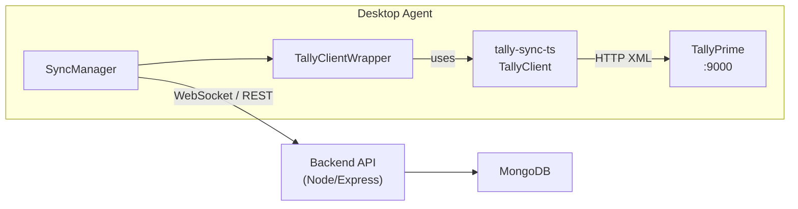

# Integrate `tally-sync-ts` into the Desktop Agent

## What `tally-sync-ts` Is

A typed TypeScript library (MIT, by the same developer) that provides:
- `TallyClient` — a typed HTTP client for every Tally master and voucher type
- XML builders (`buildExportCollectionXml`, `buildPostXml`, etc.) that match TallyPrime's envelope format exactly
- XML parsers (`parseExportCollection`, `parseTallyBoolean`, `parseTallyNumeric`, `asArray`, etc.)
- Full typed models: `Voucher`, `Ledger`, `StockItem`, `Group`, `GSTRegistration`, `Company`, `Godown`, `Unit`, `VoucherType`, and more
- Paginated fetch (`getPaginatedObjects`), count queries, and master/voucher statistics
- Deep voucher posting with `billAllocations`, `inventoryAllocations`, `batchAllocations`, `gstRateDetails`, e-way bill details

## Current State of the Desktop Agent

The desktop agent at [`desktop-agent/src/services/TallyService.js`](desktop-agent/src/services/TallyService.js) (~3,400 lines) hand-rolls all of this:
- Manual XML envelope builders (`buildSimpleExportEnvelope`, `buildDayBookRequestYyyyMmDd`, etc.)
- Manual XML parsing with `fast-xml-parser` (same dependency `tally-sync-ts` uses)
- Manual date/number normalizers (`parseTallyDate`, `toNumber`, `parseTallyBoolean`, etc.)
- Manual voucher type resolution (`resolveVoucherTypeFromTally`)
- Separate XML import builders in utility files:
  - `desktop-agent/src/utils/tallySalesVoucherImportXml.js`
  - `desktop-agent/src/utils/tallyAccountingVoucherImportXml.js`
  - `desktop-agent/src/utils/tallyLedgerImportXml.js`
  - `desktop-agent/src/utils/tallyStockItemImportXml.js`

The `SyncManager` at [`desktop-agent/src/services/SyncManager.js`](desktop-agent/src/services/SyncManager.js) orchestrates syncing masters, parties, vouchers, and reports using the hand-rolled `TallyService`.

## How the Integration Benefits the Project

### 1. Replace hand-rolled XML builders with typed builders
The library's `buildExportCollectionXml`, `buildPostXml`, `buildMasterStatisticsXml`, `buildVoucherStatisticsXml`, `buildCountRequestXml` cover every XML envelope currently built manually in `TallyService.js`. This eliminates XML typo bugs and encoding issues.

### 2. Replace manual parsers with typed parsers
`parseExportCollection<Voucher>(xml, "Voucher")` replaces hundreds of lines of manual `xmlParser.parse()` + field extraction. Type safety means broken field names are caught at compile time.

### 3. Use `TallyClient` methods directly
Instead of raw HTTP calls in `TallyService.js`, the agent can call:
```typescript
const client = new TallyClient("http://127.0.0.1", 9000);
const ledgers    = await client.getLedgers({ company });
const stockItems = await client.getObjects("StockItem", { company });
const vouchers   = await client.getPaginatedObjects("Voucher", { company, pageNum, recordsPerPage });
const count      = await client.getObjectsCount("Voucher", { company });
```

### 4. Typed Voucher posting (write-back to Tally)
Currently `buildItemVoucherImportXml` / `buildAccountingVoucherImportXml` are hand-built. The library's `client.postVouchers([...])` with full typed `InventoryAllocation`, `BillAllocation`, `CostCentreAllocation`, `GSTRateDetail`, and `EWayBillDetails` replaces all of these.

### 5. GST Registration sync (currently missing)
`client.getGSTRegistrations()` / `client.postGSTRegistrations()` — not currently synced at all from Tally.

### 6. `LastAlterIds` for incremental sync
`client.getLastAlterIds()` returns `{ mastersLastId, vouchersLastId }` — the standard Tally mechanism to detect whether anything changed since last sync, avoiding full re-fetches.

### 7. `LicenseInfo` for device identification
`client.getLicenseInfo()` returns serial number, plan name (Silver/Gold), Tally version — useful for the license/device management in the backend.

## Architecture After Integration



## Implementation Plan

### Step 1 — Install the package
```bash
# In desktop-agent/
npm install github:GreenHacker420/tally-sync-ts
```
(Not on npm yet; install directly from GitHub. Once the author publishes it, switch to `npm install tally-sync-ts`.)

### Step 2 — Convert desktop-agent to ESM or use dynamic import
`tally-sync-ts` is `"type": "module"`. The desktop-agent currently uses CommonJS (`require`). Two options:
- Add `"type": "module"` to `desktop-agent/package.json` and convert all `require()` to `import`
- Or use dynamic `import()` to wrap the ESM library in a thin CJS adapter file

### Step 3 — Wrap `TallyClient` in `TallyService.js`
Replace the HTTP/XML internals of [`desktop-agent/src/services/TallyService.js`](desktop-agent/src/services/TallyService.js) with `TallyClient` calls, keeping the same public method signatures so `SyncManager.js` needs no changes.

Key methods to replace:
- `fetchLedgers()` / `fetchParties()` → `client.getLedgers()` + typed `Ledger` model
- `fetchStockItems()` → `client.getObjects("StockItem")` + typed `StockItem`
- `fetchVouchers(from, to)` → `client.getPaginatedObjects("Voucher", { fromDate, toDate })`
- `checkConnection()` → `client.check()`
- `getActiveCompany()` → `client.getActiveCompany()`
- `importVoucher()` → `client.postVouchers()`
- `importLedger()` → `client.postObjects("Ledger", [...])`
- `importStockItem()` → `client.postObjects("StockItem", [...])`

### Step 4 — Delete redundant utility files
Once `TallyClient` is used, remove:
- `desktop-agent/src/utils/tallySalesVoucherImportXml.js`
- `desktop-agent/src/utils/tallyAccountingVoucherImportXml.js`
- `desktop-agent/src/utils/tallyLedgerImportXml.js`
- `desktop-agent/src/utils/tallyStockItemImportXml.js`

### Step 5 — Add incremental sync using `LastAlterIds`
In [`desktop-agent/src/services/SyncManager.js`](desktop-agent/src/services/SyncManager.js), before each sync cycle call `client.getLastAlterIds()` and skip the full sync if IDs haven't changed since last run. This makes the 5-minute cron much faster.

### Step 6 — Add GST Registration sync
Add a new sync type in `SyncManager` that calls `client.getGSTRegistrations()` and pushes results to the backend, populating a new `gstregistrations` collection used by the GST reports.

## Pre-build FAQ

### 1. Will this solve our slow data sync issue?

**Partially — not automatically.** Installing the library alone does not change sync speed.

**Where slowness comes from today** (in [`desktop-agent/src/services/SyncManager.js`](desktop-agent/src/services/SyncManager.js)):
- Tally HTTP export time (large date windows can hit the 15-minute timeout in `TallyService`)
- Voucher sync in date windows (7–90 days) with retries when Tally times out
- Uploading batches to the backend over WebSocket (`voucherUploadBatchSize`, concurrency)

**What `tally-sync-ts` enables if we use it deliberately:**
- **Pagination** (`getPaginatedObjects`) — smaller Tally responses per request, fewer timeouts on large ledgers/voucher sets
- **`LastAlterIds`** — skip an entire sync cycle when Tally reports no master/voucher changes (big win for the 5-minute auto-sync)
- **Cleaner parsing** — minor CPU savings; not the main bottleneck

**What it does not fix by itself:**
- Slow Tally machine or large company data volume
- Backend/WebSocket upload limits
- First-time full sync (years of vouchers) — still needs windowing and time

**Recommendation:** Treat sync speed as a separate goal. Phase 1 = swap transport/parsing without changing output shape. Phase 2 = enable pagination + `LastAlterIds` and measure before/after.

### 2. Will it break reports, voucher list/detail, dashboard, stock items, etc.?

**It should not break the web app if we integrate safely.** The frontend and ML service read **MongoDB via the backend API**, not Tally or `tally-sync-ts` directly.


**Safe approach (required):**
- Keep [`TallyService.js`](desktop-agent/src/services/TallyService.js) **public method signatures** and the **exact object shape** `SyncManager` already sends (e.g. `voucherType`, `partyName`, `totals.grandTotal`, `ledgerEntries`, `alterId`)
- Add a thin **adapter layer**: `tally-sync-ts` typed model → existing FinSync360 sync DTO (do not pass library types straight to the server)
- Regression test after each entity: vouchers, parties, items, P&amp;L/balance sheet reports

**Real risk:** If new parsers map fields differently (dates, Dr/Cr amounts, voucher type slugs, GST lines), synced data in MongoDB changes → reports and screens show wrong or empty data. That is an **implementation/testing** risk, not an inherent library problem.

**Mitigation:**
- Phased rollout: masters first, then vouchers, then write-back to Tally
- Compare sample sync output (old vs new) before switching production agents
- No frontend/backend schema changes unless we intentionally add features (e.g. GST registrations)

## Files Changed

- [`desktop-agent/package.json`](desktop-agent/package.json) — add dependency
- [`desktop-agent/src/services/TallyService.js`](desktop-agent/src/services/TallyService.js) — replace XML internals with `TallyClient`
- [`desktop-agent/src/services/SyncManager.js`](desktop-agent/src/services/SyncManager.js) — add `LastAlterIds` check and GST sync
- Delete 4 manual XML import utility files
