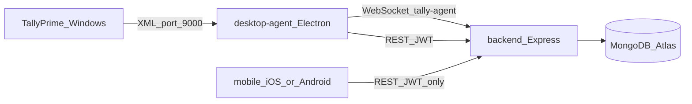
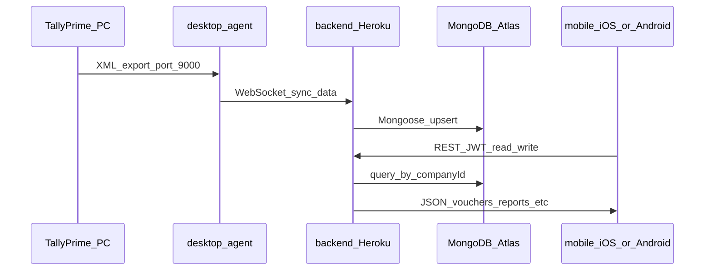

# iOS Same-as-Android Feasibility Plan

## Short answer

**Yes, it is possible** to deliver the **same product on iOS as on Android**. The data pipeline does not depend on the phone OS:

- **TallyPrime + desktop-agent** run on the **PC where Tally is open** (typically Windows). They push data to the cloud.
- **iPhone and Android** are **read/write clients** of the same backend API. They never talk to Tally or MongoDB directly.

Documented flow: [docs/SYNC_STACK_VERIFICATION.md](docs/SYNC_STACK_VERIFICATION.md).

---

## What the project already does (working stack)

| Layer | Role | Key paths |
|-------|------|-----------|
| TallyPrime | Source of truth on desktop | Port **9000** (XML/HTTP) |
| desktop-agent | Pull from Tally, push via WebSocket | [desktop-agent/src/services/SyncManager.js](desktop-agent/src/services/SyncManager.js), [WebSocketClient.js](desktop-agent/src/services/WebSocketClient.js) |
| backend | Upsert to Atlas, REST for apps | [backend/src/services/tallyWebSocketService.js](backend/src/services/tallyWebSocketService.js) |
| MongoDB Atlas | Cloud DB | `MONGODB_URI` in [backend/.env](backend/.env) — see [MONGODB_ATLAS_SETUP.md](MONGODB_ATLAS_SETUP.md) |
| mobile (Android today) | Login, vouchers, reports, sync UI | [mobile/src/](mobile/src/) — API via [mobile/src/services/apiClient.ts](mobile/src/services/apiClient.ts) |

**No backend or desktop-agent changes are required** for iOS. The same Heroku/production API URL Android uses will work on iOS.

---

## Current mobile state (important gap)

| Item | Android | iOS |
|------|---------|-----|
| Framework | React Native **0.73.2** | Same (shared JS) |
| Native project in repo | [mobile/android/](mobile/android/) present | **`mobile/ios/` missing** |
| Shared app code | [mobile/src/](mobile/src/) (~screens, services, Redux) | Reused as-is |
| Docs claim iOS ready | — | [mobile/README.md](mobile/README.md), [MOBILE_SETUP_GUIDE.md](MOBILE_SETUP_GUIDE.md) describe `ios/` and `pod install`, but folder is not checked in |
| npm scripts | `npm run android` works | `npm run ios` / `build:ios` expect [mobile/ios/FinSync360Mobile.xcworkspace](mobile/package.json) — will fail until `ios/` exists |

The **JavaScript layer is already cross-platform**: many `Platform.OS === 'ios'` branches exist (login keyboard, date pickers, biometrics, safe-area padding). Examples: [mobile/src/screens/auth/LoginScreen.tsx](mobile/src/screens/auth/LoginScreen.tsx), [mobile/src/services/biometricService.ts](mobile/src/services/biometricService.ts).

**Conclusion:** Feature parity is a **native iOS scaffold + build/signing** task, not a rewrite.

---

## What stays the same on iOS (same as Android)

- Login / JWT refresh / company selection
- Dashboard, Transactions, Inventory, Reports, Settings
- Data from Atlas **after** desktop-agent sync (same user + company)
- Production API: `API_BASE_URL` in [mobile/.env.production](mobile/.env.production) (same backend as Android)
- Optional Socket.IO realtime ([mobile/src/services/webSocketService.ts](mobile/src/services/webSocketService.ts))

**What does NOT run on the iPhone:** TallyPrime, desktop-agent, or direct MongoDB access.

---

## What you need to add for iOS (implementation outline)

### Prerequisites (cannot skip)

- **macOS** with **Xcode 14+** and **CocoaPods**
- **Apple Developer Program** account (TestFlight / App Store)
- Physical device or simulator for testing

### Step 1 — Generate and commit the iOS native project

On a Mac, from [mobile/](mobile/):

1. Use React Native 0.73 template alignment with existing app id **`com.finsync360`** (match [mobile/android/app/build.gradle](mobile/android/app/build.gradle)).
2. Typical approaches:
   - `npx @react-native-community/cli@12 init` temp project at 0.73.2, copy `ios/` into this repo and merge `app.json` name **FinSync360Mobile** / display **TallyFin**; or
   - `npx react-native upgrade` / community template copy for 0.73.2.
3. Run `cd ios && pod install`.
4. **Commit `mobile/ios/`** to git (it is not in `.gitignore` today — it was simply never added).

Fix doc naming inconsistency: deployment guide references `FinSync360.xcworkspace` while [mobile/package.json](mobile/package.json) references `FinSync360Mobile.xcworkspace` — align to one name.

### Step 2 — Wire native modules (parity with Android)

Each dependency in [mobile/package.json](mobile/package.json) needs iOS linking via CocoaPods (most autolink on RN 0.73). Pay extra attention to:

| Library | iOS action |
|---------|------------|
| `react-native-biometrics` / `react-native-keychain` | Face ID usage string in `Info.plist` |
| `react-native-permissions` | Camera, photos, notifications usage descriptions |
| `react-native-push-notification` | APNs setup (often needs `@react-native-firebase/messaging` or native APNs config — Android manifest alone is not enough) |
| `react-native-sqlite-storage` | Pod install + verify DB path on device |
| `react-native-fs`, `react-native-share`, `react-native-print` | Test voucher PDF/share flows ([VoucherDetailScreen.tsx](mobile/src/screens/VoucherDetailScreen.tsx) already branches `file://` for Android vs plain path for iOS) |
| `react-native-vector-icons` | Link fonts in Xcode / `Info.plist` |
| `react-native-config` / `react-native-dotenv` | Ensure release builds read `.env.production` |

### Step 3 — Info.plist and capabilities

Add keys for:

- `NSFaceIDUsageDescription` (biometric login)
- Camera / photo library (if image picker used)
- Background modes only if you enable background sync notifications
- App Transport Security: production uses HTTPS (Heroku) — OK; local dev may need localhost exception for simulator

### Step 4 — Environment and dev networking

- **Production:** Same `API_BASE_URL` as Android — no change.
- **Local dev on simulator:** [mobile/src/utils/devHost.ts](mobile/src/utils/devHost.ts) already leaves `localhost` unchanged for non-Android (iOS simulator can hit Mac `localhost:5000` if backend runs on the Mac).
- **Physical iPhone + local backend:** Use Mac LAN IP in `.env.development`, not `localhost`.

### Step 5 — Build, test, distribute

1. `npm run ios` — smoke test login + dashboard + vouchers list.
2. Run existing integration checks if applicable: `node test-full-integration.js` (API-only; platform-agnostic).
3. Archive: `npm run build:ios` or Xcode **Product → Archive**.
4. TestFlight → App Store (mirror Android Play flow in [MOBILE_SETUP_GUIDE.md](MOBILE_SETUP_GUIDE.md)).

### Step 6 — QA checklist (same features as Android)

- Auth: email/password, token refresh, logout
- Company switch after agent sync
- Vouchers list/detail, Transactions tab, DayBook date range
- Reports (P&L, balance sheet, outstanding, etc.)
- Inventory screens
- Biometric unlock (Face ID / Touch ID)
- Offline SQLite + sync screen (if used)
- Share/print voucher PDF on iOS device

---

## Risks and limitations (set expectations)

| Topic | Note |
|-------|------|
| **Tally on iPhone** | TallyPrime does not run on iOS. Sync still requires **Windows PC + desktop-agent**; iOS only displays cloud data. Same as Android. |
| **Build machine** | iOS builds require **Mac**; Android can build on Windows. |
| **Push notifications** | May need more iOS-specific work than Android; verify `react-native-push-notification` + APNs. |
| **App Store review** | Apple review timeline and policies differ from Play Store. |
| **Docs vs repo** | Several `.md` files state “builds for iOS and Android”; treat iOS as **planned/achievable**, not **done in repo** until `ios/` is added and CI passes. |

---

## Recommended effort estimate

| Phase | Effort (rough) |
|-------|----------------|
| Scaffold `ios/` + first simulator run | 0.5–1 day (experienced RN + Mac) |
| Native module / permission fixes | 1–3 days |
| Full QA + TestFlight | 2–5 days |
| App Store submission | 1–2 weeks (review wait) |

**Backend / desktop-agent / Atlas:** 0 days for basic parity (already shared).

---

## Architecture reference (your full requirement)

---

## Summary

| Question | Answer |
|----------|--------|
| Same sync flow for iOS? | **Yes** — phone OS does not affect Tally → agent → Atlas. |
| Same app features? | **Yes** — shared React Native `src/`. |
| What is missing today? | **`mobile/ios/` native project** + Apple signing + iOS-specific native config. |
| Change backend/desktop-agent? | **No** for standard parity. |

After you confirm this plan, implementation starts on a **Mac**: generate `ios/`, pod install, fix native module issues, then TestFlight.
