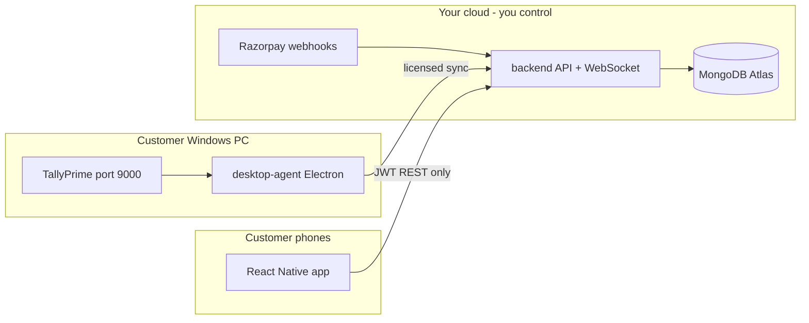
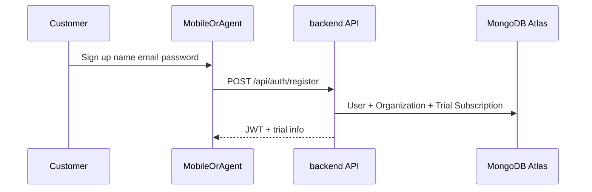
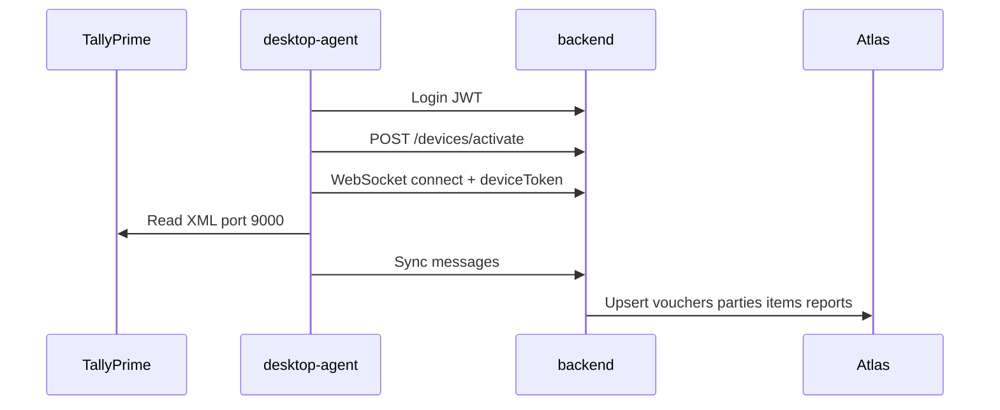
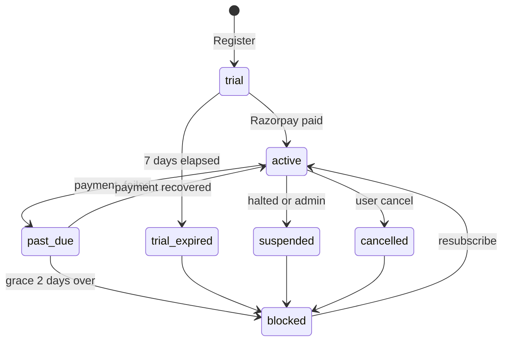

# Post-Launch Customer Journey (Core Product Only)

Web frontend ([frontend-nextjs/](frontend-nextjs/)) is **optional** for your business. The paid product customers use is:

Customers never get Atlas credentials. All data flows through **your** backend URL.

---

## What you sell (product packaging)

| Item | What customer gets | How you bill (implemented) |
|------|-------------------|---------------------------|
| **Tally sync seat** | One Windows PC running `desktop-agent` + TallyPrime | **Per device** via Razorpay `seatLimit` / `quantity` |
| **Mobile app** | Unlimited org users on iOS/Android viewing synced data | **Included** with subscription ([docs/LICENSING.md](docs/LICENSING.md)) |
| **Trial** | 7 days, **1 device**, full sync + mobile | Auto on register ([backend/src/constants/licensing.js](backend/src/constants/licensing.js)) |
| **Cloud storage** | Their company data in **your** Atlas cluster | No self-host in default tier |

**One seat = one `agentId`** (one registered Tally PC). A second office PC needs `seatLimit >= 2` and a second activation.

---

## Phase 0 — What you deploy before launch

| Component | Role | Customer-facing |
|-----------|------|-----------------|
| [backend/](backend/) on Heroku/VPS | REST + `wss://.../tally-agent` | Hidden URL baked into apps |
| MongoDB Atlas | Single source of truth | Never exposed |
| [desktop-agent/](desktop-agent/) installer | Windows `.exe` (electron-builder) | Download from your site |
| Mobile app | Play Store / App Store (or APK for pilot) | Search or link from site |
| Razorpay | Subscriptions + webhooks | Payment in browser |
| Optional: superadmin | [frontend-nextjs `/admin`](frontend-nextjs/src/app/admin/page.tsx) or `/api/admin/*` | **You only** — support, revoke, suspend |

Production env (from [docs/LICENSING.md](docs/LICENSING.md)):

- `LICENSE_ENFORCEMENT=true` (auto in production)
- `MONGODB_URI` → Atlas
- `RAZORPAY_*` + webhook `https://<your-backend>/api/billing/webhook`
- Agent build should lock `server.apiUrl` to your API (Phase 4 in architecture plan — not fully hardened yet)

---

## Phase 1 — Discovery and download

**Typical go-to-market (you choose channels):**

1. Website / WhatsApp: “Sync TallyPrime to your phone”
2. Download links:
   - **desktop-agent** Windows installer (required for sync)
   - **Mobile** from store or direct APK
3. No web ERP login required for core use

---

## Phase 2 — Registration (account + trial)

Customer creates **one org account**. Registration is implemented in:

- **Mobile:** Register screen → `POST /api/auth/register` ([backend/src/routes/auth.js](backend/src/routes/auth.js))
- **desktop-agent:** Register in agent UI → IPC `server-register` → same API ([desktop-agent/main.js](desktop-agent/main.js))

**What the backend creates automatically:**

1. `User` (role `admin`)
2. `Organization` (customer tenant)
3. `Subscription` — status `trial`, **7 days**, **seatLimit = 1** ([`createTrialOrganization`](backend/src/services/licenseService.js))
4. Optional `Company` record if they entered company name at signup

Customer receives **JWT** (login token). Same email/password works on **mobile and agent**.

---

## Phase 3 — Purchase (after trial or more devices)

**Where customer pays (no web ERP required):**

- **Mobile:** Settings → Subscription & billing ([mobile/src/screens/BillingScreen.tsx](mobile/src/screens/BillingScreen.tsx))
- **desktop-agent:** Sidebar → Subscription ([desktop-agent/renderer/src/pages/Subscription.jsx](desktop-agent/renderer/src/pages/Subscription.jsx))

**Flow:**

1. `GET /api/billing/plans` — monthly/yearly price per device (paise)
2. Customer picks **billing cycle** + **seat count** (number of Tally PCs)
3. `POST /api/billing/subscribe` → Razorpay `shortUrl`
4. Customer pays in Razorpay hosted page (browser)
5. Razorpay webhook → backend updates `Subscription` to `active`, sets `seatLimit` from quantity
6. Customer taps “Refresh status” (`POST /api/billing/sync`) if UI lags

**Product rules:** Mobile stays included; price scales with **devices**, not mobile users.

---

## Phase 4 — First-time setup on Tally PC (desktop-agent)

This is the **core** step. Order matters:

| Step | Action | Technical |
|------|--------|-----------|
| 1 | Install **desktop-agent** on the same Windows machine as **TallyPrime** | Packaged Electron app |
| 2 | Open TallyPrime; enable **ODBC/XML** (port **9000**) | Tally settings |
| 3 | Log in to agent with **same account** as mobile | JWT stored locally |
| 4 | Configure server URL (production: **pre-set**, not editable) | Points to your backend |
| 5 | Test Tally connection | [TallyService.js](desktop-agent/src/services/TallyService.js) |
| 6 | **Link Tally company** | `POST /api/companies/link-tally` |
| 7 | **Device activation** (uses 1 seat) | `POST /api/devices/activate` → `deviceToken` |
| 8 | Connect WebSocket | `wss://<backend>/tally-agent?agentId=...&deviceToken=...` |
| 9 | Run **sync** | [SyncManager](desktop-agent/src/services/SyncManager.js) → [tallyWebSocketService](backend/src/services/tallyWebSocketService.js) → Atlas |

If sync is blocked, agent shows license error (trial expired, no seats, revoked, etc.).

---

## Phase 5 — Mobile app (view data)

| Step | Action |
|------|--------|
| 1 | Install app from store / APK |
| 2 | Log in with **same email/password** |
| 3 | Select **company** (linked from Tally) |
| 4 | Dashboard, vouchers, parties, reports, outstanding, etc. | All via `GET /api/...` with JWT |

Mobile **never** connects to Atlas ([mobile/src/services/apiClient.ts](mobile/src/services/apiClient.ts)). It only talks to your API.

**Who can use mobile:** Any user you add to the org (same subscription). Enforcement is **org-level**, not per phone.

---

## Phase 6 — Day-2 operations (ongoing)

| Event | What happens |
|-------|----------------|
| Tally open daily | Agent can sync on schedule or manual sync |
| New vouchers in Tally | Next sync pushes to Atlas → mobile refreshes |
| Second Tally PC | Customer increases `seatLimit`, pays, installs agent on PC2, activates second `agentId` |
| Payment fails | Razorpay `payment.failed` → `past_due` → **2-day grace** then block |
| Customer cancels | `cancelled` / `suspended` → sync + API blocked |
| You intervene | Superadmin: revoke device, suspend org ([`/api/admin`](backend/src/routes/admin.js)) |

---

## How non-payment / abuse is controlled (production gates)

Enforcement is **on by default in production** ([`isLicenseEnforcementEnabled`](backend/src/constants/licensing.js)).

| Subscription status | Sync WebSocket | Mobile + API data | Notes |
|--------------------|----------------|-------------------|--------|
| `trial` (within 7 days) | Allowed | Allowed | 1 seat max |
| `active` | Allowed | Allowed | Up to `seatLimit` devices |
| `past_due` | Allowed during **2-day grace** | Allowed during grace | Then blocked |
| `trial_expired` | **Blocked** | **402** on protected routes | Must subscribe |
| `suspended` / `cancelled` | **Blocked** | **Blocked** | Webhook or admin |

**Three enforcement layers:**

1. **REST API** — [`requireActiveSubscription`](backend/src/middleware/license.js) on vouchers, inventory, reports, etc. Returns **402** `SUBSCRIPTION_INACTIVE` when not allowed.
2. **WebSocket sync** — [`checkDeviceLicense`](backend/src/services/licenseService.js) on connect and each sync in [tallyWebSocketService.js](backend/src/services/tallyWebSocketService.js).
3. **Device seats** — [`POST /api/devices/activate`](backend/src/routes/devices.js) refuses activation if `activeDevices >= seatLimit`; admin can `DELETE /api/devices/:agentId` to revoke.

**Superadmin** role bypasses subscription checks (for your support account only).

---

## What the customer actually “gets” (plain language)

After paying (or during trial):

- Tally data (companies, ledgers, vouchers, stock, outstanding, P&L/Balance Sheet when synced) stored in **your cloud**
- **Phone app** to view and work with that data anywhere
- **One paid seat per Tally computer** that runs the sync agent
- **7-day free trial** with 1 PC to evaluate
- Billing and seat management from **mobile or agent**, not from a website ERP

They do **not** get: database access, ability to point agent to another server (once production lock is done), or sync without an active license.

---

## Recommended launch checklist (operational)

1. Deploy backend + Atlas; set `LICENSE_ENFORCEMENT=true`
2. Configure Razorpay plans + webhook; test trial → subscribe → webhook → `active`
3. Build and sign **desktop-agent** installer with **locked** production API URL
4. Publish mobile with production `API_BASE_URL`
5. Publish install guide: Tally port 9000, login, link company, sync, then mobile login
6. Keep superadmin access for support (revoke device, extend trial manually if needed)

---

## Gaps to close before calling it “fully production-ready”

These are documented as Phase 4 in [tally_sync_architecture_2a448fc8.plan.md](tally_sync_architecture_2a448fc8.plan.md):

- Lock agent `apiUrl` in release builds (prevent bypassing your backend)
- Replace legacy Heroku URLs in env/docs with **your** domains
- Optional: Redis for multi-dyno WebSocket if you scale beyond one server process
- App store listings, installer hosting, and customer support runbook (business ops, not code)

Web frontend remains useful for **your** superadmin and optional browser billing, but is **not** on the critical path for Tally → mobile sync.
