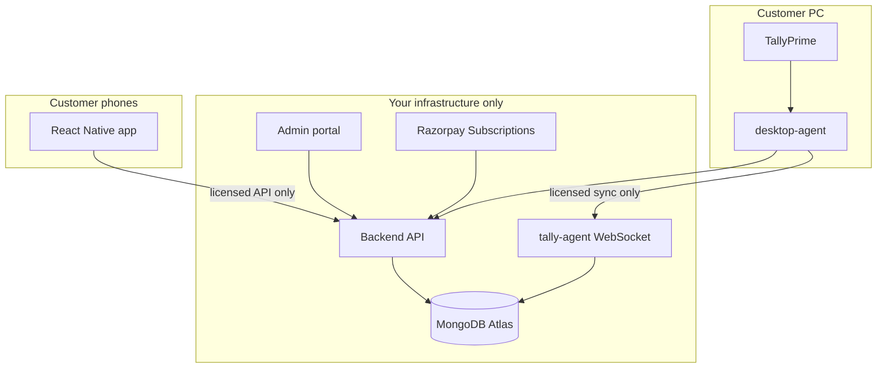
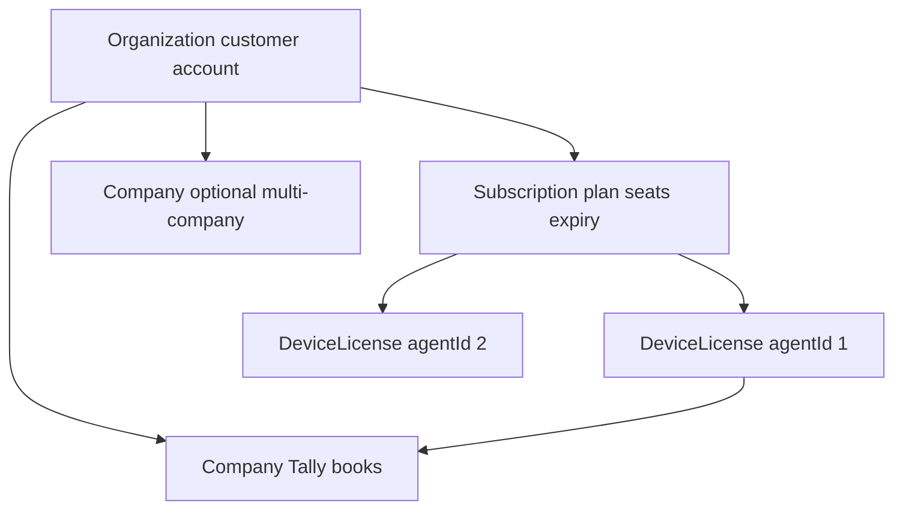
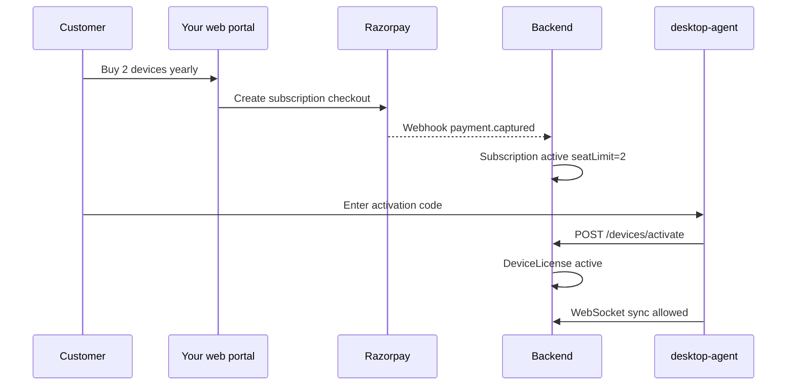
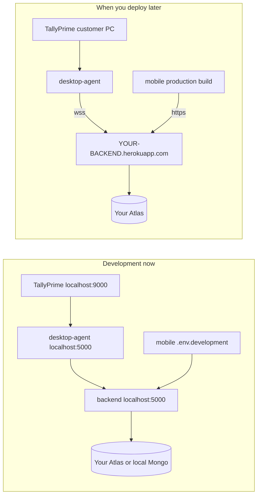

# FinSync360: Architecture + Commercial Control Plan

## Part 1 — Current system (unchanged)

Your working flow:

| Step | Component |
|------|-----------|
| 1 | TallyPrime on customer PC (port 9000) |
| 2 | [`desktop-agent`](desktop-agent/) pulls XML via [`TallyService.js`](desktop-agent/src/services/TallyService.js) |
| 3 | [`SyncManager`](desktop-agent/src/services/SyncManager.js) → [`WebSocketClient`](desktop-agent/src/services/WebSocketClient.js) → `wss://<your-backend>/tally-agent` |
| 4 | [`tallyWebSocketService.js`](backend/src/services/tallyWebSocketService.js) upserts to **MongoDB Atlas** |
| 5 | Mobile app reads via **REST + JWT** only ([`apiClient.ts`](mobile/src/services/apiClient.ts)) — never Atlas directly |

---

## Part 2 — Your business goal: per device, per period, full control

### What “all things in our hand” means

| You control | Customer gets | Why |
|-------------|---------------|-----|
| MongoDB Atlas + all data | No DB credentials, no self-host option (default tier) | Data and backups stay yours |
| Backend URL (Heroku/VPS) | Agent + mobile point only to **your** API | No sync without your server |
| License / subscription state | Activation code or login tied to paid org | Stop service when unpaid |
| Device registry | One billable **seat** per `agentId` (Tally PC) | Per-device pricing |
| Revoke / suspend | Instant block on WS + API | Non-payment or contract end |
| Billing webhooks | Auto activate/deactivate seats | No manual chasing |
| Agent installer | Signed build, locked `apiUrl` in production | Harder to bypass |

### Implemented (Phases 1–3)

- `Organization`, `Subscription`, `DeviceLicense` models + [`licenseService.js`](backend/src/services/licenseService.js)
- Device APIs: `/api/devices/activate`, license-status, revoke
- `requireActiveSubscription` on REST; license checks on WebSocket connect + every sync
- Razorpay subscriptions: `/api/billing/*` + webhooks
- Admin + billing UI (web, mobile, agent subscription pages)
- **Product rules confirmed:** mobile included; **7-day trial, 1 device**; **2-day grace** after failed payment

### Still open (Phase 4)

- Production agent build: lock `server.apiUrl` (customers should not point agent elsewhere)
- Replace **reference** Heroku URLs left in repo from prior owners (see Part 8)
- Optional: Redis for multi-dyno WebSocket when you outgrow one Heroku web dyno ([`docs/HEROKU_SCALING.md`](docs/HEROKU_SCALING.md))

---

## Part 3 — Recommended commercial model

### Pricing unit

| Product | Billable unit | Typical rule |
|---------|---------------|--------------|
| **Tally sync (desktop-agent)** | 1 seat = 1 PC running agent + Tally | **Per device / month or year** (your main SKU) |
| **Mobile app** | Usually bundled | e.g. unlimited users per org, or “included with N devices” |
| **Optional add-ons** | Company count, ML, GST portal | Higher tiers |

Define clearly in contracts: **device** = one registered `agentId` on one physical/virtual Windows machine.

### Tenant hierarchy (new data model)

**Suggested MongoDB collections:**

- **`Organization`** — customer legal name, billing email, status (`trial`, `active`, `suspended`, `cancelled`)
- **`Subscription`** — `planId`, `billingCycle` (`monthly`/`yearly`), `seatLimit`, `seatsUsed`, `currentPeriodEnd`, `razorpaySubscriptionId`, `status`
- **`DeviceLicense`** — `organizationId`, `agentId` (unique), `machineFingerprint`, `hostname`, `status` (`pending`, `active`, `revoked`), `activatedAt`, `lastSeenAt`, linked `companyId`(s)
- Extend **`Company`** — add `organizationId` (tenant isolation)
- Extend **`User`** — `organizationId` + role; mobile/agent users belong to one org

### Enforcement gates (where to block unpaid usage)

1. **WebSocket connect** — [`tallyWebSocketService.verifyClient`](backend/src/services/tallyWebSocketService.js): after JWT/apiKey, resolve `agentId` → `DeviceLicense` → org subscription active and `seatsUsed <= seatLimit`
2. **Every sync message** — `handleSyncData` / `handleSyncDataBatch`: re-check license (handles mid-session expiry)
3. **REST API** — [`middleware/auth.js`](backend/src/middleware/auth.js): add `requireActiveSubscription` on `/api/vouchers`, `/api/companies`, etc.
4. **Mobile** — same middleware; expired org gets `402 Payment Required` with renewal link
5. **Agent activation** — new `POST /api/devices/activate` with one-time code; creates `DeviceLicense` only if seats available

### Billing flow (India-friendly: extend existing Razorpay)

- Use **Razorpay Subscriptions** (or Plans + Subscriptions API) for recurring monthly/yearly
- Webhook handler: `subscription.activated`, `subscription.charged`, `subscription.cancelled`, `payment.failed`
- On failure: grace period (e.g. 7 days) → `suspended` → block WS + API
- On cancel: devices `revoked` at period end

Alternative: **Stripe Billing** if you sell outside India later.

### Agent changes (desktop-agent)

| Change | Purpose |
|--------|---------|
| **Activation screen** | User enters org code from your portal (not free registration) |
| **Store `deviceToken`** | Short-lived JWT scoped to `agentId` + `organizationId` (replace shared `DESKTOP_AGENT_API_KEY` in production) |
| **License heartbeat** | Every 24h or each sync: `GET /api/devices/license-status` |
| **Production build** | `server.apiUrl` / `server.url` baked at build time; hide or disable custom server URL in UI |
| **Graceful degrade** | If license invalid: stop sync, show “Renew subscription” with link |

### Mobile changes

- Login only for users under an **active** organization
- No separate per-phone billing unless you want it later (keeps sales simple: “price per Tally PC”)

### Admin portal (your internal control panel)

Use existing `superadmin` role on [`User`](backend/src/models/User.js). Build in [`frontend-nextjs`](frontend-nextjs/) or a small admin app:

- List organizations, subscriptions, devices
- Manual: extend trial, add seats, revoke device, suspend org
- Metrics: last sync per device, data volume, active connections ([`TallyConnection`](backend/src/models/TallyConnection.js))

### Security / anti-bypass checklist

- Never ship `.env` with `MONGODB_URI` to customers
- Rotate away from one global `DESKTOP_AGENT_API_KEY` → per-device tokens
- Rate-limit activation attempts
- Bind `DeviceLicense` to `agentId` + optional hardware fingerprint; transfer device = admin “deactivate old / activate new”
- Legal: license agreement prohibiting reverse engineering / alternate backends
- Code signing for Windows installer (SmartScreen trust)

---

## Part 4 — Deployment model (hosted SaaS only for standard customers)

| Tier | Who hosts backend | Who owns data | Your control |
|------|-------------------|---------------|--------------|
| **Standard (recommended)** | You (Heroku/VPS + Atlas) | You (processor); customer is data controller under DPA | Maximum |
| **Enterprise (optional later)** | Customer VPC or on-prem | Negotiated | Lower; charge premium |

For “everything in our hand,” sell **Standard** only at launch: **your** MongoDB Atlas + **your** backend host (Heroku or VPS) + public agent installer.

**Current stage:** development on localhost — **not** deployed to your own Heroku yet. URLs like `finsync-backend-d34180691b06.herokuapp.com` in the repo are **reference only** (previous team); do not treat them as your production API.

---

## Part 5 — Implementation phases

| Phase | Status | Notes |
|-------|--------|-------|
| **1** Licensing models + enforcement | Done | Trial 7d / 1 seat; grace 2d |
| **2** Razorpay subscriptions + webhooks | Done | Configure keys in `backend/.env` when ready |
| **3** Admin + billing UI | Done | Web, mobile, agent |
| **4** Hardening + your deploy | Pending | Your Heroku URLs, lock agent API URL, scrub reference URLs |

---

## Part 6 — Development checklist (use now)

| Step | What to use |
|------|-------------|
| Backend | `cd backend && npm run dev` → `http://localhost:5000` |
| MongoDB | Your Atlas URI in `backend/.env` as `MONGODB_URI` (or local Mongo for experiments) |
| Licensing in dev | `LICENSE_ENFORCEMENT=false` in `backend/.env` for friction-free testing |
| Desktop-agent | Defaults in [`ConfigManager.js`](desktop-agent/src/services/ConfigManager.js): `apiUrl` `http://127.0.0.1:5000/api`, WS `ws://127.0.0.1:5000/tally-agent` |
| Mobile | [`mobile/.env.development`](mobile/.env.development): `http://localhost:5000/api` (use `adb reverse` for physical device) |
| Web admin | `NEXT_PUBLIC_API_URL=http://localhost:5000` in frontend-nextjs env |
| Tally | Port 9000 on same PC as agent |

---

## Part 7 — Confirmed product decisions

1. **Mobile included** in per-device pricing — yes
2. **Trial:** 7 days, 1 device seat
3. **Grace after failed payment:** 2 days
4. **Multi-company per device:** supported via agent `linkedCompanies` (unchanged)

---

## Part 8 — Where to add Heroku (only when you deploy)

You do **not** need Heroku during day-to-day development. When you create **your own** Heroku apps, set URLs in these places (replace `YOUR-BACKEND` with your app name, e.g. `mycompany-finsync-api`):

### 1. Heroku config (secrets — not in git)

On **your** backend app (`heroku config:set`):

| Variable | Example |
|----------|---------|
| `MONGODB_URI` | Your Atlas connection string |
| `JWT_SECRET`, `ENCRYPTION_KEY` | Strong random values |
| `LICENSE_ENFORCEMENT` | `true` |
| `RAZORPAY_*`, `BILLING_*` | Your Razorpay account |
| `BILLING_CALLBACK_URL` | `https://YOUR-FRONTEND/settings/billing` |
| `NODE_ENV` | `production` |

Razorpay webhook URL (Dashboard): `https://YOUR-BACKEND.herokuapp.com/api/billing/webhook`

Scripts to customize app names (not the old `finsync-backend` names):

- [`heroku-deploy.sh`](heroku-deploy.sh) — interactive first-time deploy
- [`deploy-services.sh`](deploy-services.sh) — set `BACKEND_APP`, `FRONTEND_APP`, `ML_APP` to **your** app names

### 2. Client env files (your URLs only at release)

| File | Variables |
|------|-----------|
| [`mobile/.env.production`](mobile/.env.production) | `API_BASE_URL`, `WEBSOCKET_URL`, `TALLY_AGENT_URL`, `ML_SERVICE_URL` |
| [`mobile/src/services/apiClient.ts`](mobile/src/services/apiClient.ts) | Remove or replace hardcoded `PRODUCTION_API_URL` fallback |
| [`frontend-nextjs`](frontend-nextjs/) | `NEXT_PUBLIC_API_URL=https://YOUR-BACKEND.herokuapp.com` |
| Desktop-agent production build | Bake `server.apiUrl` + `server.url` (wss) — Phase 4 |
| [`ml-service/.env`](ml-service/.env.example) | `BACKEND_API_URL=https://YOUR-BACKEND.herokuapp.com/api` |

### 3. Backend CORS (allow your frontend origin)

[`backend/src/server.js`](backend/src/server.js) — add your frontend URL to the CORS allowlist (today it lists old `finsync-frontend-*.herokuapp.com` entries).

### 4. Documentation (optional cleanup)

Reference-only URLs appear in [`docs/ARCHITECTURE.md`](docs/ARCHITECTURE.md), [`docs/DEPLOYMENT.md`](docs/DEPLOYMENT.md), [`docs/PRODUCTION_SUMMARY.md`](docs/PRODUCTION_SUMMARY.md), mobile README/tests — replace with placeholders or your URLs when you go live. [`docs/HEROKU_SCALING.md`](docs/HEROKU_SCALING.md) stays valid as **guidance** (1 web dyno for `/tally-agent`).

### Dev vs prod at a glance

**Rule:** Until you own Heroku apps, every client should talk to `localhost:5000` (or your LAN IP for phone testing). Never point development builds at someone else’s `finsync-backend-*.herokuapp.com`.

---

## Summary

Core flow and commercial controls (per-device licensing, Razorpay, admin UI) are in place. **Heroku is optional infrastructure for later** — use local backend + your Atlas URI now; when you launch, swap URLs only in env/config/deploy scripts above and keep **one** backend web dyno until WebSocket scaling is added. Reference Heroku links in the repo are not your environment.
